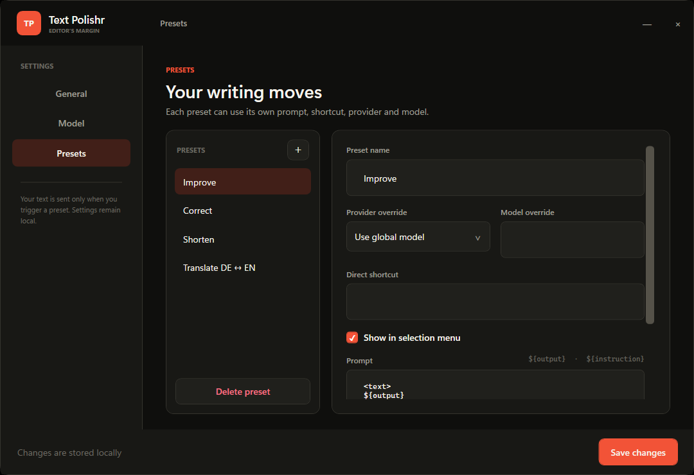
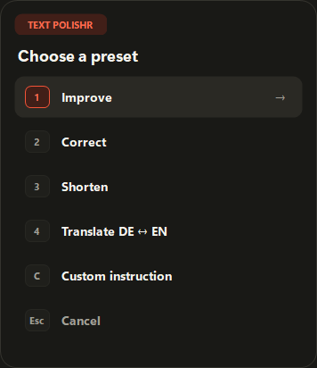

# Text Polishr

Transform selected text in any Windows application with your preferred LLM —
then put it back exactly where it came from.

[](https://github.com/13324/TextPolishr/actions/workflows/ci.yml)
[](https://github.com/13324/TextPolishr/releases/latest)
[](LICENSE)

**[Download the latest Windows version](https://github.com/13324/TextPolishr/releases/latest/download/TextPolishr-win-x64.zip)**

Text Polishr is a small Windows tray application. Select text in Word, Outlook,
a browser, an editor, or another application; press a shortcut; choose a preset;
and the revised text replaces the selection. The original application keeps
focus, and its normal `Ctrl+Z` undo remains available.



## A very important thank-you to Handy

Text Polishr would not exist in this form without
**[Handy](https://handy.computer)** by CJ Pais and its
**[open-source repository](https://github.com/cjpais/Handy)**.

Handy is genuinely excellent. Its careful work on system-wide text insertion,
Windows clipboard transactions, delayed rendering, provider configuration, and
LLM post-processing demonstrated how this kind of tool should be engineered.
Text Polishr is heavily inspired by that work, and important parts of its
clipboard transaction architecture and provider configuration were adapted
from Handy's MIT-licensed source. Text Polishr removes the speech stack and
focuses that foundation on selected-text rewriting.

If you want excellent system-wide voice dictation and transcription, use
[Handy](https://handy.computer). Full license attribution is preserved in
[THIRD_PARTY_NOTICES.md](THIRD_PARTY_NOTICES.md).

## What it does

- Captures selected text through the target application's normal copy behavior.
- Offers a focusless preset menu or direct shortcut per preset.
- Supports `Custom` instructions for one-off transformations.
- Sends only the selected text and rendered prompt to the configured provider.
- Revalidates the target and selection before replacing anything.
- Uses a receipt-aware clipboard transaction and restores the prior clipboard.
- Keeps the last three original/result pairs locally for recovery.
- Rejects empty model responses and never replaces text on validation failure.



## Quick start

1. Download `TextPolishr-win-x64.zip` from the
   [latest release](https://github.com/13324/TextPolishr/releases/latest).
2. Extract the ZIP and run `TextPolishr.exe`.
3. Open **Settings** from the tray icon.
4. Under **Model**, choose a provider, enter an API key, and select or type a
   model ID.
5. Review the built-in **Presets**, then save.
6. Select text in another application and press `Ctrl+Alt+Space`.

The binary is currently unsigned, so Windows SmartScreen may show a warning on
first launch. Review the source or build it locally if that is a concern.

## Presets

Every preset can define its own:

- Name and prompt
- Direct global shortcut
- Provider and model override
- Visibility in the focusless preset menu

Prompts use `${output}` for the selected text. The Custom preset additionally
supports `${instruction}` for the one-off instruction.

The menu supports mouse clicks, number keys, arrow keys plus Enter, `C` for
Custom, and `Esc` to cancel.

## Providers

The built-in configuration includes OpenAI, Anthropic, OpenRouter, Z.AI, Groq,
Cerebras, AWS Bedrock through Mantle, and custom OpenAI-compatible endpoints.
Model lists can be refreshed when the provider exposes a compatible endpoint.

## Privacy and local data

Only the selected text, rendered preset prompt, and optional custom instruction
are sent to the configured provider. Window titles, filenames, surrounding
document content, earlier transformations, and prior clipboard data are not
sent.

Text Polishr stores these files locally:

- `%APPDATA%\TextPolishr\settings.json` — configuration and API keys in plain text
- `%APPDATA%\TextPolishr\history.json` — up to three original/result pairs
- `%APPDATA%\TextPolishr\diagnostics.log` — technical errors, never selected text

## Compatibility boundary

The baseline is a focused editable field that supports `Ctrl+C` and `Ctrl+V`.
Password fields, elevated applications when Text Polishr is not elevated,
protected documents, remote sessions, and applications that block normal
clipboard input may reject capture or paste. In those cases the target remains
unchanged.

## Build from source

Requirements: Windows and the .NET 10 SDK.

```powershell
dotnet restore TextPolishr.slnx
dotnet build TextPolishr.slnx -c Release --no-restore
dotnet run --project tests/TextPolishr.Tests/TextPolishr.Tests.csproj -c Release --no-build
```

Create the same self-contained Windows package used for releases:

```powershell
dotnet publish src/TextPolishr/TextPolishr.csproj -c Release -r win-x64 `
  --self-contained true -p:PublishSingleFile=true -p:PublishTrimmed=false `
  -p:IncludeNativeLibrariesForSelfExtract=true -o publish/win-x64
```

## Contributing

Issues and focused pull requests are welcome. Read
[CONTRIBUTING.md](CONTRIBUTING.md) before making a larger change. Security
problems should follow [SECURITY.md](SECURITY.md), not a public issue.

## Roadmap

- Optional preview-before-replace mode per preset
- Rich-text and Word-specific adapters
- Installer, code signing, and managed update channel
- Optional encrypted local history and credential storage
- UI Automation selection metadata for stronger duplicate-selection detection

## License

Text Polishr is licensed under the [MIT License](LICENSE). Adapted Handy code
retains its original MIT notice in [THIRD_PARTY_NOTICES.md](THIRD_PARTY_NOTICES.md).
